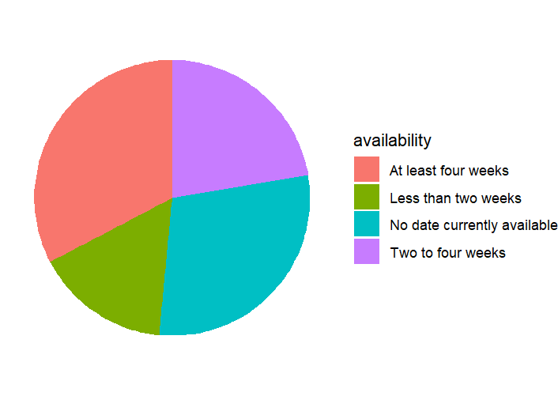
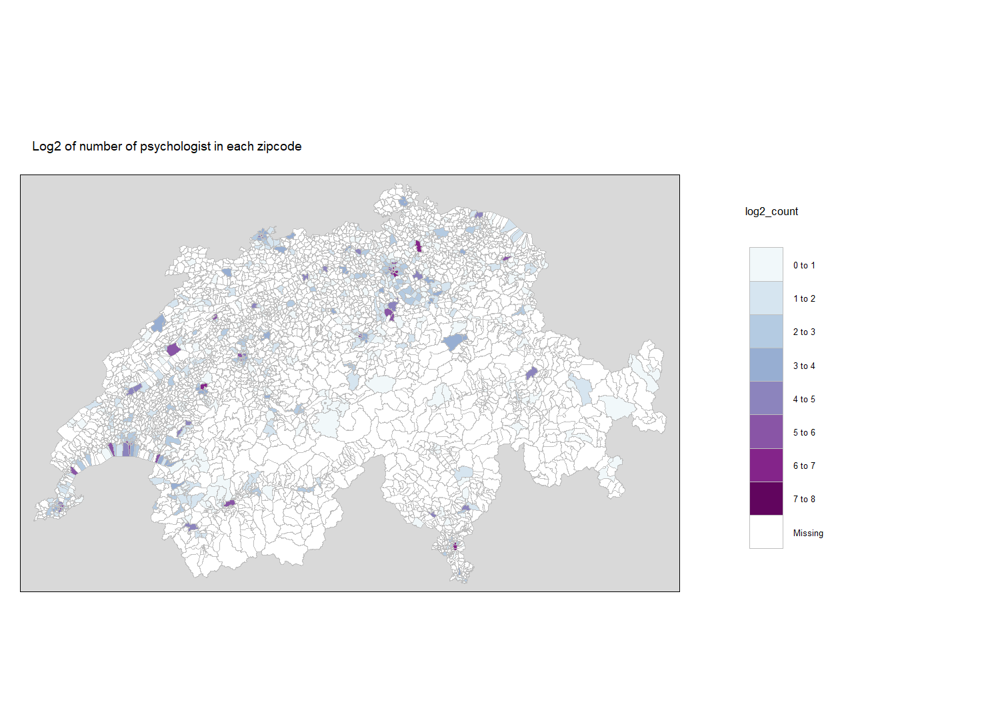
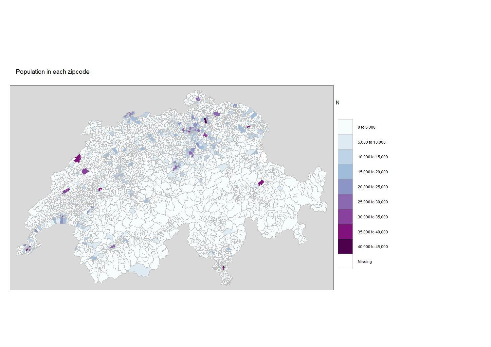
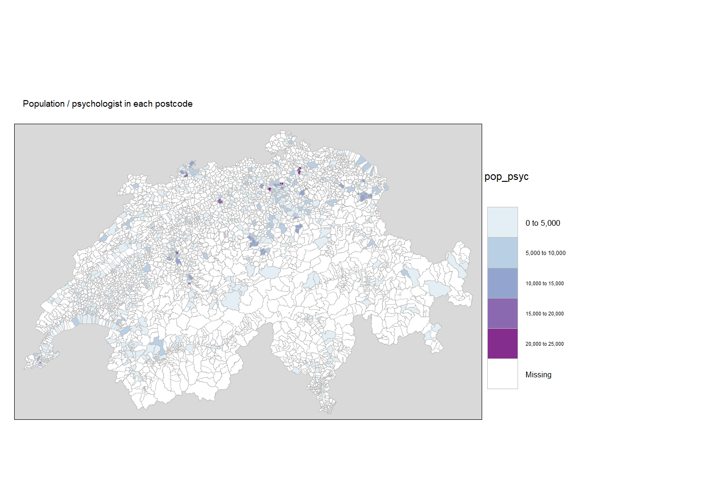

```{r setup, include=FALSE}
knitr::opts_chunk$set(echo = TRUE)
```

# Introduction

Availability of appropriate healthcare services is essential for a fulfilling human life. Psychiatric illnesses are currently one of the leading causes for absence from work, health related suffering and lower overall quality of life. Fast access to appropriate treatment can prevent further complications and psychiatric illnesses from becoming cronic. Since 2022, Switzerland has eased access to psychological counselling by including fixed-term psychologists' interventions in the basic insurance with the referral from a general practitioner. The largest association for psychologists (FSP) in Switzerland provides information about psychological services in the country and a tool for psychologist to promote their availability and for clients to search for counseling after their wishes.

## Aim of the project:

In this project I utilise the information on counselling providers around Switzerland as provided by FSP's Psyfinder (<https://www.psychologie.ch/en/psyfinder-map>). The aim of the project is to to assess availability of counseling around Switzerland, including filtering for some basic features including the billing system. This project then contributes to the understanding health equality in Switzerland.

## Project source material:

The list of profile links from the psyfinder website were scraped on 8th of May 2024. At this time the profiles of 3738 psychologists in Switzerland were listed.

Shapefiles for the map visualisations were downloaded from Kanton Luzerns Geodata portal: <https://daten.geo.lu.ch/produkt/grzplzxx_ds_v1>

The excel file for population in each postcode area in Switzerland was downloaded from the Swiss Federal Statistical Office: <https://www.bfs.admin.ch/asset/de/26565300> . The data corresponds to population data from 2022, which was deemed as adequate for the scope of this project.

## Project rundown

## 1. Scraping the data

### 1.1. Initial preparations

The project started by investigation of the website to be scraped (<https://www.psychologie.ch/en/psyfinder-map>). The website uses dynamic elements, i.e. infinite scrolling which made the scraping more difficult. After some research and trials, scrolling the page with a Selenium server powered external browser was as the most functional way to achieve the goal.

Further, to scroll to the end of the list of psychologists it was necessary to first open the the list of the website, i.e. asking selenium to click the right button. A selector gadget and inspecting the webpage was used.

```{r}
library(RSelenium)
library(wdman)

rd <- rsDriver(browser = "firefox",
               chromever = NULL)

driver <- rd$client

#setting the window size, since phone adapted website is easier to manage

driver$setWindowSize(360, 640)

#navigating to the website with the selenium driver
driver$navigate('https://www.psychologie.ch/en/psyfinder-map')

html <- driver$getPageSource()[[1]]
print(html)

pageEl  <- driver$findElements(using = "css", value = "a")

#clicking open the button to show all the results
button_element <- driver$findElement(using = "class name", "d-md-none")
button_element$clickElement()

#scrolling to the bottom of the page to load all the results
scroll_element <- driver$findElement(using = "class name", "overflow-scroll")
scroll_element$sendKeysToElement(list(key = "end"))

#creating a loop that does the infine scroll

for(i in 1:50){
  scroll_element$sendKeysToElement(list(key = "end"))
  Sys.sleep(8)
}

```

When the website was scrolled all the way to the bottom the result was saved in an HTML file in order to scrape the eventual profile links without the need to scroll the page again.

```{r}
html <- driver$getPageSource()[[1]]
writeLines(html, "psyfinder.html")

```

### 1.2 Scraping the profile links

To scrape the needed information from the counselor profiles on the psyfinder-website it was necessary to create a list of profile links to be used in the scraping process. A selector gadget and inspecting the webpage was used to find the right node.

```{r}
library(rvest)
library(httr)

links <- read_html("psyfinder.html") %>%
  html_elements(css = "a") %>%
  html_attr(name = "href")

#checking where the profile links start and end

links[1:60]

links[3700:3796]

#profile links start at 56 and end at 3793

links_profiles <- links[56:3793]

#Saving the links to a csv file

write.csv(links_profiles, "profilelinks.csv", row.names = FALSE)
```

The list links_profiles includes only the profile links (n = 3738).

To scrape the right information from the profile, an example code was created.

To extract the information under titles "Address", "Target groups", "Languages", "Availability" and "Billing", it was necessary to find the correct Xpath node to access this information. This process included several trials. At first, a test was conducted on the first profile. I found the right node with selector gadget then identified the needed information in the numbered element. This produced the needed information for the first node. However, during a test scraping attempt it turned out the due to the different structure of each profile (e.g. some included more information than others) the same code would not work for all profiles. Sometimes the right information was not returned at all, sometimes it was found in the wrong element.

Finding a sufficient solution involved inspecting the Xpath notations. Finally, a solution where using the parent-child notation for returned the right results.

The code below provides an test for fetching the address - replacing it with the other keywords returned the corresponding right information.

```{r}

#reading the needed information from the first profile in the html file

test <- read_html(links_profiles[1]) %\>% html_elements(xpath = '//h3[.="Address"]/parent::div') %\>% html_text2() %\>% str_replace("Address\n", "") %\>% str_replace_all("\n", " ")
```

Finally, this information was scraped from all the profiles to form a dataset for later analysis.

Additionally, new variable "postcode" was formed for the analysis.

```{r}
#turning links_profiles into a character vector
psychologist_combined <- data.frame(Title = character(), stringsAsFactors = FALSE)

i <- 0
for (profile_link in links_profiles) {
  i <- i + 1
  pages <- GET(
    profile_link,
    add_headers(From = "email", 'User-Agent' = R.Version()$version.string)
  )
  if (status_code(pages) == 200) {
    # Check if the request was successful
    print("Success!")
  } else {
    print("Error!")
    print(status_code(pages))
  }
  Sys.sleep(5)
  
  
  bin <- content(pages, as = "parsed")
  
  availability <- bin %>%
    html_elements(xpath = '//div[.="Availability"]/parent::div') %>%
    html_text2() %>%
    strsplit("\n")
  
  group <- bin %>%
    html_elements(xpath = '//div[.="Target groups"]/parent::div') %>%
    html_text2() %>%
    strsplit("\n")
  
  bill <- bin %>%
    html_elements(xpath = '//div[.="Billing"]/parent::div') %>%
    html_text2() %>%
    strsplit("\n")
  
  lang <- bin %>%
    html_elements(xpath = '//div[.="Languages"]/parent::div') %>%
    html_text2() %>%
    strsplit("\n")
  
  addr <- bin %>%
    html_elements(xpath = '//h3[.="Address"]/parent::div') %>%
    html_text2() %>%
    str_replace("Address\n", "") %>%
    str_replace_all("\n", " ")
  
  zipcode <- str_extract(addr, "\\d{4}") #extracting the zipcode

  
  data <- list(
    address = addr[[1]][1],
    availability = availability[[1]][2],
    groups = group[[1]][2],
    languages = lang[[1]][2],
    billing = bill[[1]][2],
    zipcode = zipcode
  )
  
  
  psychologist_df <- data.frame(data)
  
  psychologist_combined <- rbind.data.frame(psychologist_combined, psychologist_df)
}

```

The data was the saved to a csv file for further analysis.

```{r}
write.csv(psychologist_combined, "psychologist_combined.csv", row.names = FALSE)
```

## 2. Data analysis

### 2.1. Data cleaning

As the postcode is one of the most central variables in the analysis, it was necessary to check the quality of the data. The code below checks the number of missing/invalid values in the postcode variable.

```{r}
library(tidyverse)
library(ggplot2)
library(stringr)

#find out all the unique values in the column zipcode

zipcode_list <- unique(data$zipcode)

#sorting the list

zipcode_list <- sort(zipcode_list)

zipcode_list

#data includes zipcodes that are not valid (e.g. only one number for a postcode), so we need to filter out the invalid zipcodes

valid_zipcode <- zipcode_list[grepl("^\\d{4}$", zipcode_list)]

print(valid_zipcode)

#removing the profiles with invadid zipcodes from the data

psychologist_df <- data %>% filter(zipcode %in% valid_zipcode)
```

After filtering 3723 profiles were left for further analysis.

### 2.2. Descriptive statistics

Which zipcodes have the most psychologists? This was assessed by counting the number of psychologists in zipcodes separately and by the first digit of the zipcode.

```{r}
zipcode_count <- psychologist_df %>% group_by(zipcode) %>% summarise(count = n()) %>% arrange(desc(count))

zipcode_count

#checking the count for larger areas and filtering by the first digit of the postcode

zipcode_count$first_digit <- substr(zipcode_count$zipcode, 1, 1)

zipcode_count <- zipcode_count %>% group_by(first_digit) %>% summarise(count = sum(count)) %>% arrange(desc(count))

zipcode_count
```

The zipcodes with the most psychologists are: 1003 with 141 psychologists, 3011 with 124 psychologists and 8006 with 99 psychologists

Zipcodes starting with 1 (Vaud and Wallis) have the highest number of psychologist (1208), then 8 / Zurich (946), 3/ Bern (418), 6/ Luzern (395)

Coverance by basic insurance was also assessed.

```{r}
psychologist_df$billing <- as.factor(psychologist_df$billing)

psychologist_df %>% group_by(billing) %>% summarise(count = n()/3723)
```

Some psychologist report several options for billing. Those who don't mention "covered by basic insurance" account for 15 % of the psychologist. 85 % do have this text on their profile. We land on the conclusion that the majority of psychologists in Switzerland are covered by basic insurance.

What about the availability of the psychologists?

```{r}
psychologist_df %>% group_by(availability) %>% summarise(count = n()/3723)
```

15,8 % are available in less than 2 weeks, 22,3 % in 2-4 weeks, 32,7 % at least four weeks, 29,2 % don't have any availability. In conclusion, 60 % of the psychologist one has to wait at least 4 weeks

A pie chart was created to visualise the availability of the psychologists.

```{r}
availability_pie <- psychologist_df %>% 
  group_by(availability) %>% 
  summarise(count = n()) %>% 
  ggplot(aes(x = "", y = count, fill = availability)) +
  geom_bar(stat = "identity") +
  coord_polar("y", start = 0) +
  theme_void() +
  theme(legend.position = "bottom") +
  labs(title = "Availability of psychologists in Switzerland")

availability_pie

```

{width="350"}

Next, the availability of psychological counselling for different groups was assessed. A sample of target groups was selected as these groups seem like the most common ones. As the profiles usually mention several groups, we had to use a regular expression combined with detection to find the right count. Additionally, as "adults" were sometimes mentioned two times (Adults and young adults were separed groups), the code was adjusted to count only the first mention of the keyword.

```{r}
keywords <- c("Children", "Teenagers", "Adults", "Couples")

count_keyword <- function(keyword) {
  str_detect(psychologist_df$groups, regex(paste0("\\b", keyword, "\\b"), ignore_case = TRUE))
}

# Apply the function to each keyword and sum the results
keyword_counts <- sapply(keywords, function(keyword) sum(count_keyword(keyword)))

keyword_percentages <- (keyword_counts / 3723) * 100

# Convert to a data frame for better readability
keyword_counts_df <- data.frame(keyword = keywords, count = keyword_counts, percentage = keyword_percentages)

# Print the table
print(keyword_counts_df)
```

The following table was created:

```         
            keyword count percentage 
Children   Children   979   26.29600 
Teenagers Teenagers  1543   41.44507 
Adults       Adults  3598   96.64249
Couples     Couples  1327   35.64330
```

The majority of psychologists in Switzerland provide services for adults, while the availability of services for children, teenagers and couples is lower. Children and youth might enjoy similar services through e.g. schools, which might explain the relatively low number of psychologist focusing on these target groups.

Finally, the availability of counseling in different languages was analysed. A selection of some common languages were picked and their frequency in the data analysed. "Swiss" stands for Swiss German to avoid counting German twice.

```{r}
print(psychologist_df$languages)

if (any(is.na(psychologist_df$languages))) {
  stop("There are NA values in the languages column.")
}

#There are NA values in the languages so we need to adjust the code slightly

languages <- c("English", "German", "French", "Italian", "Swiss", "Portuguese", "Russian", "Arabic", "Turkish", "Chinese", "Serbian", "Spanish")

count_language <- function(language) {
  detected <- str_detect(coalesce(psychologist_df$languages, ""), regex(paste0("\\b", language, "\\b"), ignore_case = TRUE))
  print(paste("Language:", language))
  print(detected)
  return(detected)
}

# Apply the function to each keyword and sum the results
language_counts <- sapply(languages, function(language) sum(count_language(language)))

print(language_counts)

language_percentages <- (language_counts / 3723) * 100

language_counts_df <- data.frame(keyword = languages, count = language_counts, percentage = language_percentages)

# Print the table and organise the results by highest percentage first

language_counts_df <- language_counts_df[order(-language_counts_df$percentage), ]

print(language_counts_df)
```

The following table shows the number of psychologists providing counseling in the selected languages and their percentage share of all psychologists. As expected, German, French, English, Swiss German and Italian are the most common languages for counseling.

```         
              keyword count percentage 
German         German  2180 58.5549288 
French         French  1735 46.6022025 
English       English  1558 41.8479721 
Swiss           Swiss  1216 32.6618319 
Italian       Italian   545 14.6387322 
Spanish       Spanish   284  7.6282568 
Portuguese Portuguese   112  3.0083266 
Russian       Russian    30  0.8058018 
Turkish       Turkish    25  0.6715015 
Serbian       Serbian    24  0.6446414 
Arabic         Arabic    19  0.5103411 
Chinese       Chinese     0  0.0000000
```

### 2.3 Map visualisations

The data was visualised on a map to assess whether different areas have equal access to psychological counseling. This involved finding the right geodata for Switzerland with the unit of the analysis: postcode areas. This data was found from City of Luzern's data portal and downloaded on the computer as a shapefile with the name "zipcodemap".

An original aim was to explore the possibility of making an interactive map that would. This would've allowed the user to look at the map more thoroughly and presenting the next visualisations in one map. Due to time and other resource limitations this was not possible. Thus, unfortunately the maps here don't provide data on spesific locations or values.

```{r}
library(sf)
library(leaflet)
library(tmap)
library(dplyr)
library(shinyjs)

#reading the shp file for a map of switzerland with zipcode areas to R

mapdata <- sf::st_read("zipcodemap.shp")

#checking that the data was read correctly

print(mapdata)

#plotting the map

tmap_mode("plot")

#renaming the zipcode column to "PLZ" to match with the names in the shapefile

psychologist_df$PLZ <- psychologist_df$zipcode
```

Four maps were created. This process involved creating a summary variable of the wanted information and merging it with the mapdata dataframe.

1.  Number of psychologists in each area code

```{r}
#creating a map that shows the number of psychologists in each zipcode. 

psyc_count <- psychologist_df %>% group_by(PLZ) %>% summarise(count = n())

#Merging the zipcode_count dataframe with the mapdata dataframe. We use log2 to make the differences more visible.

mapdata <- merge(mapdata, psyc_count, by.x = "PLZ", by.y = "PLZ", all.x = TRUE)

mapdata$log2_count <- log2(mapdata$count)

tm_shape(mapdata) +
  tm_polygons(col = "log2_count", 
              border.col = "grey",
              lwd = 0.05,
              palette = "BuPu", 
              n = 6,
              style = "pretty",
              colorNA = "white") +
  tm_layout(main.title = "Log2 of number of psychologist in each zipcode",
            main.title.size = 0.8,
            bg.color = "grey85",
            legend.outside = TRUE,
            legend.position = c("right", "bottom"))

```



City areas seem to have a higher number of psychologists. This is also expected, as these areas have a higher population.

2.  Population in each area code

It is important to understand how the population is spread between the zipcodes to assess the possible need for counseling. Thus, the population data per zipcode was downloaded from the Swiss Federal Statistical Office. This excel file included sheets of population data for multiple years and for multiple groups (e.g. share of different age groups in the population). To speed up the process the right data was selected in excel and saved to csv-file.

This file was then read to R and merged with the mapdata dataframe.

```{r}
popdata <- read.csv("populationPLZ.csv")

#selecting columns of interest

View(popdata)

#ccreating a map that shows the population in each zipcode to visually compare with the number of psychologists

mapdata <- merge(mapdata, popdata, by.x = "PLZ", by.y = "PLZ", all.x = TRUE)

tm_shape(mapdata) +
  tm_polygons(col = "N", 
              border.col = "grey",
              lwd = 0.1,
              palette = "BuPu", 
              n = 6,
              style = "pretty",
              colorNA = "white") +
  tm_layout(main.title = "Population in each zipcode",
            main.title.size = 0.8,
            bg.color = "grey85",
            legend.outside = TRUE,
            legend.position = c("right", "bottom"))
```



Population seems to be distributed similarly as the psychologist, i.e. psychologists seem to be located where people live. Noteworthy is, however, that population is not spread as centralised as the psychologists. Additionally, Switzerland seems to have a lot of zipcodes with less than 5000 inhabitants. This is logical due to the mountainous geography.

3.  Relative number of psychologists per population in each zipcode

Is there an equal share of psychologist per population for each zipcode? Using the population data and the data on number of psychologist was visualised on a separate map. This map shows the number of people, or potential clients, per psychologist in each zipcode.

```{r}
mapdata$pop_psyc <- mapdata$N/mapdata$count

tm_shape(mapdata) +
  tm_polygons(col = "pop_psyc", 
              border.col = "grey",
              lwd = 0.1,
              palette = "BuPu", 
              n = 6,
              style = "pretty",
              colorNA = "white") +
  tm_layout(main.title = "Population / psychologist in each postcode",
            main.title.size = 0.8,
            bg.color = "grey85",
            legend.outside = TRUE,
            legend.position = c("right", "bottom"))


```



There seems to be less psychologists per capita in the German speaking Switzerland, compared to other areas in the country. Around cities the population per psychologist is higher as expected. In many neighbouring areas the situation is similar. This might mean that traveling a bit further might help, but in some cases this distance might be even longer.

4.  Availability of counseling around Switzerland

Are counseling services as readily available in all areas of Switzerland? This was assessed by creating a map that shows the average availability of psychologists in each zipcode. The availability variable was first transformed into a numerical variable to make average availability count possible. A range was then created to show the availability in four categories: good availability, fairly good availability, low availability and no availability.

```{r}
#checking which values the availability variable in psychologist_df takes

unique(psychologist_df$availability)

#assigning a numerical value to the availability variable

availability_to_numeric <- function(availability) {
  if (availability == "Less than two weeks") {
    return(1)
  } else if (availability == "Two to four weeks") {
    return(2)
  } else if (availability == "At least four weeks") {
    return(3)
  } else if (availability == "No date currently available") {
    return(4)
  } else {
    return(NA)  # or another default value if needed
  }
}

psychologist_df <- psychologist_df %>%
  mutate(availability_numeric = sapply(availability, availability_to_numeric))

View(psychologist_df$availability_numeric)

#creating a map that shows the average availability of psychologists in each zipcode

psyc_availability <- psychologist_df %>% group_by(PLZ) %>% summarise(availability_numeric = mean(availability_numeric, na.rm = TRUE))

mapdata <- merge(mapdata, psyc_availability, by.x = "PLZ", by.y = "PLZ", all.x = TRUE)

mapdata <- mapdata %>%
  mutate(availability_category = cut(availability_numeric,
                                     breaks = c(-Inf, 1.5, 2.5, 3.5, Inf),
                                     labels = c("Good availability", "Fairly good availability", "Low Availability", "No availability")))

tm_shape(mapdata) +
  tm_polygons(col = "availability_category", 
              border.col = "grey",
              lwd = 0.1,
              palette = "BuPu", 
              n = 4,
              style = "pretty",
              colorNA = "white") +
  tm_layout(main.title = "Availability of psychologists in each zipcode",
            main.title.size = 0.8,
            bg.color = "grey85",
            legend.outside = TRUE,
            legend.position = c("right", "bottom"))

```


There is a bit of variation in availability of counseling in Switzerland. Some areas are clearly highlighted as "no availability". Some of these areas seem to be low in both population and number of psychologist - thus, the availability reflects the availability of just few psychologists operating in the area. However, some of these areas seem also secluded, with no other central area nearby. Thus, there might be low number of psychologist with low availability in the area, and very long distance to the closest center with similar services.

Around the Basel area availability seems very low, thus people might need to wait long times to find psychological help. The situation seems similar in the Luzern area. Availability around Zürich seems similar in the greater area, varying between fairly good and low availability. There might be a wait to get help, but usually one should be able to find a psychologist with availability. The situation is similar around the Lac Léman region. The italian speaking areas seem to have a balanced number of psychologist per population, with fairly good availability in most cases.

## 3. Conclusions

The aim of this project was to scrape information of counseling services in Switzerland through the FSP's Psyfinder. The project turned out to be more complex than thought at first glance, and involved gettimg familiar with Selenium server, Xpath and geodata. This project report provides the rundown of the necessary steps as well as examples of analysis options on the data.

As a conclusion, Switzerland seems like a country where both population and counseling services are quite centered in cities or larger towns. Although with some queuing time, in most areas there seem to be availability of psychologist services. The examples here leave a lot for discovery. Mapping e.g. hospitals might expand the understanding of psychiatric help in Switzerland.
